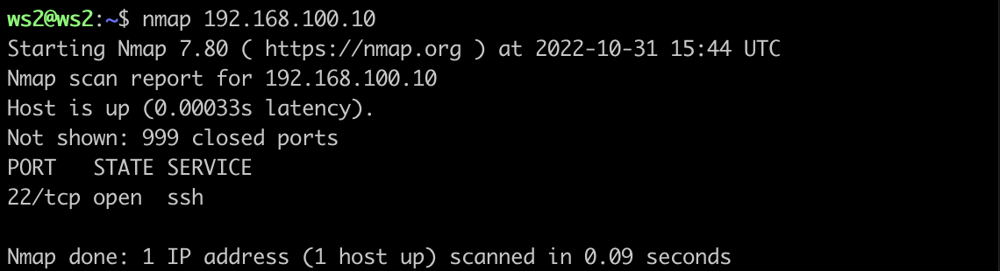
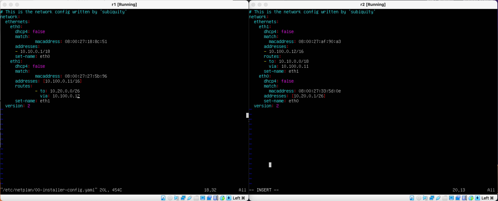
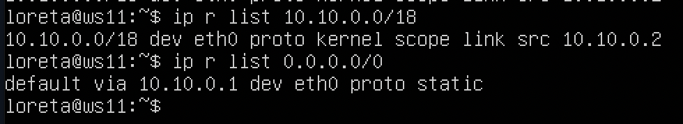

# Сети в Linux

## Contents

   2.1. [Стек протоколов TCP IP](#стек-протоколов-tcp-ip) \
   2.2. [Адресация](#адресация) \
   2.3. [Маршрутизация](#маршрутизация)
3. [Chapter III](#chapter-iii) \
   3.1. [Инструмент ipcalc](#part-1-инструмент-ipcalc) \
   3.2. [Статическая маршрутизация между двумя машинами](#part-2-статическая-маршрутизация-между-двумя-машинами) \
   3.3. [Утилита iperf3](#part-3-утилита-iperf3) \
   3.4. [Сетевой экран](#part-4-сетевой-экран) \
   3.5. [Статическая маршрутизация сети](#part-5-статическая-маршрутизация-сети) \
   3.6. [Динамическая настройка IP с помощью DHCP](#part-6-динамическая-настройка-ip-с-помощью-dhcp) \
   3.7. [NAT](#part-7-nat) \
   3.8. [Допополнительно. Знакомство с SSH Tunnels](#part-8-дополнительно-знакомство-с-ssh-tunnels)
4. [Chapter IV](#chapter-iv)


## Part 1. Инструмент **ipcalc**

##### Поднять виртуальную машину (далее -- ws1)

#### 1.1. Сети и маски

##### 1) Адрес сети *192.167.38.54/13* = 192.160.0.0


| Маска/адрес | Десятичный вид | Двоичный вид |
|---|---|---|
| маска подсети: |  255.248.0.0 | 11111111.11111000.00000000.00000000 |
| & | |
| адрес клиента: | 192.167.38.54 | 11000000.10100111.00100110.00110110 |
| = | |
| адрес сети:    |  192.160.0.0 | 11000000.10100000.00000000.00000000 |


##### 2) Перевод маски *255.255.255.0* в префиксную и двоичную запись, */15* в обычную и двоичную, *11111111.11111111.11111111.11110000* в обычную и префиксную

| Обычная запись | Двоичная запись | Префиксная запись |
|---|---|---|
| 255.255.255.0 | 11111111.11111111.11111111.00000000 | /24 |
| 255.254.0.0 | 11111111.11111110.00000000.00000000 | /15 |
| 255.255.255.240 | 11111111.11111111.11111111.11110000 | /28 |


##### 3) Минимальный и максимальный хост в сети *12.167.38.4* при масках: */8*, *11111111.11111111.00000000.00000000*, *255.255.254.0* и */4*

| Маска | Минимальный хост | Максимальный хост |
|---|---|---|
| /8 | 12.0.0.1 | 12.255.255.254 |
| 11111111.11111111.00000000.00000000 | 12.167.0.1 | 12.167.255.254 |
| 255.255.254.0 | 12.167.38.1 | 12.167.39.254 |
| /4 | 0.0.0.1 | 15.255.255.254 |


'''

'''
#### 1.2. localhost
##### Определить и записать в отчёт, можно ли обратиться к приложению, работающему на localhost, со следующими IP: *194.34.23.100*, *127.0.0.2*, *127.1.0.1*, *128.0.0.1*

- localhost - 127.0.0.1/8

|IP-адрес|Возможность|
|---|---|
|194.34.23.100|False|
|127.0.0.2|True|
|127.1.0.1|True|
|128.0.0.1|False|

#### 1.3. Диапазоны и сегменты сетей
##### Определить и записать в отчёт:
##### 1) какие из перечисленных IP можно использовать в качестве публичного, а какие только в качестве частных: *10.0.0.45*, *134.43.0.2*, *192.168.4.2*, *172.20.250.4*, *172.0.2.1*, *192.172.0.1*, *172.68.0.2*, *172.16.255.255*, *10.10.10.10*, *192.169.168.1*


|IP-адрес|Публичный|Частный|
|---|---|---|
|10.0.0.45||+|
|134.43.0.2|+||
|192.168.4.2||+|
|172.20.250.4||+|
|172.0.2.1|+||
|192.172.0.1|+||
|172.68.0.2|+||
|172.16.255.255||+|
|10.10.10.10||+|
|192.169.168.1|+||


##### 2) какие из перечисленных IP адресов шлюза возможны у сети *10.10.0.0/18*: *10.0.0.1*, *10.10.0.2*, *10.10.10.10*, *10.10.100.1*, *10.10.1.255*

- *Шлюз - компьютер, осуществляющий взаимодействие с другими сетями. Диапазон возможных шлюзов для конкретной сети помечается в выводе ipcalc, начиная с HostMin и до HostMax (невключительно).*


|IP-адрес|Возможность для сети 10.10.0.0/18|
|---|---|
|10.0.0.1|False|
|10.0.0.2|True|
|10.10.10.10|True|
|10.10.100.1|False|
|10.10.1.255|True|


## Part 2. Статическая маршрутизация между двумя машинами

`-` Теперь разберёмся, как связать две машины, используя статическую маршрутизацию.

**== Задание ==**

##### Поднять две виртуальные машины (далее -- ws1 и ws2)

- Подняли 2 виртуальные машины. В настройках Virtual Box к каждой добавили Адаптер 2 - адаптер внутренней сети. Далее при вызове ip a увидим, что появился третий сетевой интерфейс как раз засчет добавления порта 2.


##### С помощью команды `ip a` посмотреть существующие сетевые интерфейсы

```bash
ws1@ws1:~$ ip a
1: lo: <LOOPBACK,UP,LOWER_UP> mtu 65536 qdisc noqueue state UNKNOWN group default qlen 1000
    link/loopback 00:00:00:00:00:00 brd 00:00:00:00:00:00
    inet 127.0.0.1/8 scope host lo
       valid_lft forever preferred_lft forever
    inet6 ::1/128 scope host
       valid_lft forever preferred_lft forever
2: enp0s3: <BROADCAST,MULTICAST,UP,LOWER_UP> mtu 1500 qdisc fq_codel state UP group default qlen 1000
    link/ether 08:00:27:6d:92:ee brd ff:ff:ff:ff:ff:ff
    inet 10.0.2.15/24 brd 10.0.2.255 scope global dynamic enp0s3
       valid_lft 85266sec preferred_lft 85266sec
    inet6 fe80::a00:27ff:fe6d:92ee/64 scope link
       valid_lft forever preferred_lft forever
3: enp0s8: <BROADCAST,MULTICAST> mtu 1500 qdisc noop state DOWN group default qlen 1000
    link/ether 08:00:27:d3:2b:27 brd ff:ff:ff:ff:ff:ff
```

```bash
ws2@ws2:~$ ip a
1: lo: <LOOPBACK,UP,LOWER_UP> mtu 65536 qdisc noqueue state UNKNOWN group default qlen 1000
    link/loopback 00:00:00:00:00:00 brd 00:00:00:00:00:00
    inet 127.0.0.1/8 scope host lo
       valid_lft forever preferred_lft forever
    inet6 ::1/128 scope host
       valid_lft forever preferred_lft forever
2: enp0s3: <BROADCAST,MULTICAST,UP,LOWER_UP> mtu 1500 qdisc fq_codel state UP group default qlen 1000
    link/ether 08:00:27:60:8c:d4 brd ff:ff:ff:ff:ff:ff
    inet 10.0.2.15/24 brd 10.0.2.255 scope global dynamic enp0s3
       valid_lft 86336sec preferred_lft 86336sec
    inet6 fe80::a00:27ff:fe60:8cd4/64 scope link
       valid_lft forever preferred_lft forever
3: enp0s8: <BROADCAST,MULTICAST> mtu 1500 qdisc noop state DOWN group default qlen 1000
    link/ether 08:00:27:5a:da:56 brd ff:ff:ff:ff:ff:ff
```

##### Описать сетевой интерфейс, соответствующий внутренней сети, на обеих машинах и задать следующие адреса и маски: ws1 - *192.168.100.10*, маска */16*, ws2 - *172.24.116.8*, маска */12*


```bash
ws1@ws1:~$ cat /etc/netplan/00-installer-config.yaml
# This is the network config written by 'subiquity'
network:
  ethernets:
    enp0s3:
      dhcp4: true
    enp0s8:
      dhcp4: false
      addresses: [192.168.100.10/16]
  version: 2
```

```bash
ws2@ws2:~$ cat /etc/netplan/00-installer-config.yaml
# This is the network config written by 'subiquity'
network:
  ethernets:
    enp0s3:
      dhcp4: true
    enp0s8:
      dhcp4: false
      addresses: [172.24.116.8/12]
  version: 2
```


##### Выполнить команду `netplan apply` для перезапуска сервиса сети
- В отчёт поместить скрин с вызовом и выводом использованной команды.

```bash
$ netplan --debug apply
```


#### 2.1. Добавление статического маршрута вручную
##### Добавить статический маршрут от одной машины до другой и обратно при помощи команды вида `ip r add`


```bash
ws1@ws1:~$ sudo ip r add 172.24.116.8 dev enp0s8
```


```bash
ws2@ws2:~$ sudo ip r add 192.168.100.10 dev enp0s8
```


##### Пропинговать соединение между машинами


#### 2.2. Добавление статического маршрута с сохранением

- После перезапуска пинганем и увидим, что машны не пингуются :(

```bash
ws1@ws1:~$ ping 172.24.116.8
PING 172.24.116.8 (172.24.116.8) 56(84) bytes of data.
^C
--- 172.24.116.8 ping statistics ---
10 packets transmitted, 0 received, 100% packet loss, time 9216ms
```

- Изменим файл *etc/netplan/00-installer-config.yaml*, дабы все изменения и после перезапуска оставались.


- Примем изменения с помощью sudo netplan apply и пропингуем соединение между машинами


## Part 3. Утилита **iperf3**

*В данном задании используются виртуальные машины ws1 и ws2 из Части 2*

#### 3.1. Скорость соединения

|Скорость|Перевод|Результат|
|---|---|---|
|8 Mbps|8/8|1 MB/s|
|100 MB/s|100 * 1024 * 8|819200 Kbps|
|1 Gbps|1 * 1024|1024 Mbps|


#### 3.2. Утилита **iperf3**
##### Измерить скорость соединения между ws1 и ws2


- iperf3 работает по клиент-серверной модели. Машина, скорость которой будем измерять - клиент. Другая машина будет играть роль сервера. На сервере запускаем команду

```bash
iperf3 -s
```

- На клиенте запускаем команду ниже, где <ip_addr> - адрес нашего сервера.

```bash
iperf3 -c <ip_addr>
```


## Part 4. Сетевой экран

`-` После соединения машин, перед нами стоит следующая задача: контролировать информацию, проходящую по соединению. Для этого используются сетевые экраны.

**== Задание ==**

*В данном задании используются виртуальные машины ws1 и ws2 из Части 2*

#### 4.1. Утилита **iptables**

##### Создадим файл */etc/firewall.sh*, имитирующий фаерволл, на ws1 и ws2:

```bash
#!/bin/sh

# Удаление всех правил в таблице "filter" (по-умолчанию).
iptables –F  # Delete all rules in  chain or all chains
iptables -X  # Delete a user-defined chain

# Добавление новых правил, синтаксис
iptables -A {INPUT|OUTPUT} -p icmp -j {ACCEPT|REJECT|DROP}
iptables -A {INPUT|OUTPUT} -p icmp --icmp-type {echo-reply|echo-request} -j {ACCEPT|REJECT|DROP}

```


```bash
# Добавление портов
iptables -A INPUT -p tcp --dport 80 -j ACCEPT
iptables -A INPUT -p tcp --dport 22 -j ACCEPT
```
- -A  - append to chain
- -p - cетевой протокол. Допустимые варианты — TCP, UDP, ICMP или ALL
- --dport - порт назначения
- -j - target

iptables -A OUTPUT -p icmp --icmp-type echo-reply -j ACCEPT
iptables -A OUTPUT -p icmp --icmp-type echo-reply -j DROP

##### Нужно добавить в файл подряд следующие правила:
##### 1) на ws1 применить стратегию когда в начале пишется запрещающее правило, а в конце пишется разрешающее правило (это касается пунктов 4 и 5)
##### 2) на ws2 применить стратегию когда в начале пишется разрешающее правило, а в конце пишется запрещающее правило (это касается пунктов 4 и 5)
##### 3) открыть на машинах доступ для порта 22 (ssh) и порта 80 (http)
##### 4) запретить *echo reply* (машина не должна "пинговаться”, т.е. должна быть блокировка на OUTPUT)
##### 5) разрешить *echo reply* (машина должна "пинговаться")
- В отчёт поместить скрины с содержанием файла */etc/firewall* для каждой машины.
##### Запустить файлы на обеих машинах командами `chmod +x /etc/firewall.sh` и `/etc/firewall.sh`


- В отчёте описать разницу между стратегиями, применёнными в первом и втором файлах.

#### 4.2. Утилита **nmap**
##### Командой **ping** найти машину, которая не "пингуется", после чего утилитой **nmap** показать, что хост машины запущен
*Проверка: в выводе nmap должно быть сказано: `Host is up`*
- В отчёт поместить скрины с вызовом и выводом использованных команд **ping** и **nmap**.




##### Сохранить дампы образов виртуальных машин

## Part 5. Статическая маршрутизация сети

`-` Пока что мы соединяли всего две машины, но теперь пришло время для статической маршрутизации целой сети.

**== Задание ==**

Сеть: \


#### 5.0 Подготовочка
- Создала я 5 новых машин полным клонированием машины из предыдущего пункта, на которой предустановила все необходимые в следующих пунктах утилиты. Также сменила логин с ws1 на loreta во избежание путаницы и для каждой машины поменяла hostname, отредактировав файл /etc/hostname (и затем перезапустив систему).

- Для каждой машины отключила адаптер 1, отвечающий за интернет. Для роутеров в настройках добавила адаптер 3.

- _Очень важное замечание: на схеме опечатка для роутера 2: названия eth0, eth1 перепутаны местами_

#### 5.1. Настройка адресов машин





#### 5.2. Включение переадресации IP-адресов.

Параметр ip_forward отвечает за то, воспринимает ли себя машина как узел сети или же как маршрутизатор - то есть она - конечная точка передачи пакетов (параметр = 0) или должна их пытаться переслать дальше (=1).

`sysctl -w net.ipv4.ip_forward=1` - меняет форвардинг, но после ребута параметр снова =0.

`net.ipv4.ip_forward = 1` - меняет навсегда на =1.

Этот параметр также можно просмотреть в файле /proc/sys/net/ipv4/ip_forward.

- Полезная ссылка: https://qsetup.ru/linux-chto-takoye-ip-forward/


#### 5.3. Установка маршрута по-умолчанию
Пример вывода команды `ip r` после добавления шлюза:
```
default via 10.10.0.1 dev eth0
10.10.0.0/18 dev eth0 proto kernel scope link src 10.10.0.2
```
##### Для настройки шлюза уже были добавлены gateway4 \[ip роутера\] в файлы конфигураций.


##### Проверка вызовом  `ip r` 


##### Пропингуем с ws11 роутер r2 и покажем на r2, что пинг доходит. Для этого используем команду:
`tcpdump -tn -i eth1`


#### 5.4. Добавление статических маршрутов
##### Добавим в роутеры r1 и r2 статические маршруты в файле конфигураций. Пример для r1 маршрута в сетку 10.20.0.0/26:
```shell
# Добавить в конец описания сетевого интерфейса eth1:
- to: 10.20.0.0
  via: 10.100.0.12
```
- В отчёт поместить скрины с содержанием изменённого файла *etc/netplan/00-installer-config.yaml* для каждого роутера.


##### Вызвать `ip r` и показать таблицы с маршрутами на обоих роутерах. Пример таблицы на r1:
```
10.100.0.0/16 dev eth1 proto kernel scope link src 10.100.0.11
10.20.0.0/26 via 10.100.0.12 dev eth1
10.10.0.0/18 dev eth0 proto kernel scope link src 10.10.0.1
```


##### Запустим команды на ws11:
`ip r list 10.10.0.0/[маска сети]` и `ip r list 0.0.0.0/0`





#### 5.5. Построение списка маршрутизаторов
##### Запустим на r1 команду дампа:
`tcpdump -tnv -i eth0`
##### При помощи утилиты **traceroute** построим список маршрутизаторов на пути от ws11 до ws21


_Принцип работы построения пути при помощи **traceroute**_

#### 5.6. Использование протокола **ICMP** при маршрутизации
##### Запустим на r1 перехват сетевого трафика, проходящего через eth0 с помощью команды:
`tcpdump -n -i eth0 icmp`
##### Пропингуем с ws11 несуществующий IP (например, *10.30.0.111*) с помощью команды:
`ping -c 1 10.30.0.111`


## Part 6. Динамическая настройка IP с помощью **DHCP**
_Ссылка: https://www.opennet.ru/base/net/dhcp_setup.txt.html_

**== Задание ==**

_Перед тем, как отключать внешнюю сеть, было необходимо установить нужные пакеты:_
```bash
sudo apt install isc-dhcp-server
sudo apt install resolvconf
```
1) На прежнем поле работы с теми же машинами открываем */etc/dhcp/dhcpd.conf* для r2 и редактируем его, как указано в задании:

```shell
subnet 10.100.0.0 netmask 255.255.0.0 {}

subnet 10.20.0.0 netmask 255.255.255.192
{
    range 10.20.0.2 10.20.0.50;
    option routers 10.20.0.1;
    option domain-name-servers 10.20.0.1;
}
```


2) В файле *resolv.conf* прописываем `nameserver 8.8.8.8.`


- Перезагрузим службу **DHCP** командой `systemctl restart isc-dhcp-server`. Машину ws21 перезагрузим при помощи `reboot` и через `ip a` покажем, что она получила адрес. 


_Итог: айпишник изменился с 10.20.0.2 на 10.20.0.3_

- Пропингуем ws22 с ws21.


##### Жесткая привязка к мак-адрессу
1) Если мак-адрес отличен от желаемого, то через менеджер в настройках машины можно его изменить (Адаптер -> дополнительно -> мак-адрес) 

2) В *etc/netplan/00-installer-config.yaml* добавим строчки `macaddress: 10:10:10:10:10:BA`, `dhcp4: true`


3) Для жесткой настройки r1 с мак-адресом ws11 используем следующую конструкцию в dhcpd.conf:

```bash
host myhost {
               hardware ethernet xx:xx:xx:xx:xx:xx;
               fixed-address 192.168.0.9;
           }
```


4) Проверим айпишник ws11 до и после ребута:


_Итог: айпишник изменился с 10.20.0.2 на 10.10.0.53 (до этого было 20, а не 10, так как второй роутер назначил айпишник)_

##### Обновление айпишника без ребута

_Для этого достаточно запустить 2 команды с рассматриваемой машины:_

```bash
dhclient -r eth0    # чистка старых конфигураций DHCP

dhclient -v eth0    # запрос новых конфигураций
```


## Part 7. **NAT**
`-` Ну и, наконец, в качестве вишенки на торте, я расскажу тебе про механизм преобразования адресов.

**== Задание ==**

*В данном задании используются виртуальные машины из Части 5*
##### В файле */etc/apache2/ports.conf* на ws22 и r1 изменить строку `Listen 80` на `Listen 0.0.0.0:80`, то есть сделать сервер Apache2 общедоступным
- В отчёт поместить скрин с содержанием изменённого файла.
##### Запустить веб-сервер Apache командой `service apache2 start` на ws22 и r1
- В отчёт поместить скрины с вызовом и выводом использованной команды.
##### Добавить в фаервол, созданный по аналогии с фаерволом из Части 4, на r2 следующие правила:
##### 1) Удаление правил в таблице filter - `iptables -F`
##### 2) Удаление правил в таблице "NAT" - `iptables -F -t nat`
##### 3) Отбрасывать все маршрутизируемые пакеты - `iptables --policy FORWARD DROP`
##### Запускать файл также, как в Части 4
##### Проверить соединение между ws22 и r1 командой `ping`
*При запуске файла с этими правилами, ws22 не должна "пинговаться" с r1*
- В отчёт поместить скрины с вызовом и выводом использованной команды.
##### Добавить в файл ещё одно правило:
##### 4) Разрешить маршрутизацию всех пакетов протокола **ICMP**
##### Запускать файл также, как в Части 4
##### Проверить соединение между ws22 и r1 командой `ping`
*При запуске файла с этими правилами, ws22 должна "пинговаться" с r1*
- В отчёт поместить скрины с вызовом и выводом использованной команды.
##### Добавить в файл ещё два правила:
##### 5) Включить **SNAT**, а именно маскирование всех локальных ip из локальной сети, находящейся за r2 (по обозначениям из Части 5 - сеть 10.20.0.0)
*Совет: стоит подумать о маршрутизации внутренних пакетов, а также внешних пакетов с установленным соединением*
##### 6) Включить **DNAT** на 8080 порт машины r2 и добавить к веб-серверу Apache, запущенному на ws22, доступ извне сети
*Совет: стоит учесть, что при попытке подключения возникнет новое tcp-соединение, предназначенное ws22 и 80 порту*
- В отчёт поместить скрин с содержанием изменённого файла.
##### Запускать файл также, как в Части 4
*Перед тестированием рекомендуется отключить сетевой интерфейс **NAT** (его наличие можно проверить командой `ip a`) в VirtualBox, если он включен*
##### Проверить соединение по TCP для **SNAT**, для этого с ws22 подключиться к серверу Apache на r1 командой:
`telnet [адрес] [порт]`
##### Проверить соединение по TCP для **DNAT**, для этого с r1 подключиться к серверу Apache на ws22 командой `telnet` (обращаться по адресу r2 и порту 8080)
- В отчёт поместить скрины с вызовом и выводом использованных команд.

##### Сохранить дампы образов виртуальных машин
**p.s. Ни в коем случае не сохранять дампы в гит!**

## Part 8. Дополнительно. Знакомство с **SSH Tunnels**

`-` Пожалуй, на этом у меня всё. Может у тебя появились ещё какие-то вопросы?

`-` Да, я хотел спросить ещё об одной вещи. На работе я краем уха услышал, что в моей компании есть некие проекты по обучению. Подробностей я не знаю, но очень хочется взглянуть... Вдруг будет полезно

`-` Действительно интересно, но как в этом помогу тебе я?

`-` Дело в том, что, чтобы добраться до этих проектов, нужно получить доступ к закрытой сети. Можешь посоветовать что-нибудь по этому поводу?

`-` Ну ты, конечно, даёшь... Не уверен на все сто, что это поможет, но могу рассказать тебе про **SSH Tunnels**.

**== Задание ==**

*В данном задании используются виртуальные машины из Части 5*

##### Запустить на r2 фаервол с правилами из Части 7
##### Запустить веб-сервер **Apache** на ws22 только на localhost (то есть в файле */etc/apache2/ports.conf* изменить строку `Listen 80` на `Listen localhost:80`)
##### Воспользоваться *Local TCP forwarding* с ws21 до ws22, чтобы получить доступ к веб-серверу на ws22 с ws21
##### Воспользоваться *Remote TCP forwarding* c ws11 до ws22, чтобы получить доступ к веб-серверу на ws22 с ws11
##### Для проверки, сработало ли подключение в обоих предыдущих пунктах, перейдите во второй терминал (например, клавишами Alt + F2) и выполните команду:
`telnet 127.0.0.1 [локальный порт]`
- В отчёте описать команды, необходимые для выполнения этих четырёх пунктов, а также приложить скриншоты с их вызовом и выводом.

##### Сохранить дампы образов виртуальных машин
**p.s. Ни в коем случае не сохранять дампы в гит!**

## Chapter IV

`-` Спасибо тебе большое за помощь!

`-` Всегда пожалуйста! Мне тоже не было лишним вспомнить основы администрирования. Я решил освоить что-нибудь новое и заняться DevOps'ом.

`-` Ого! Уже нашёл, куда устроиться?

`-` Да, правда придётся переехать. Так что, в следующий раз тебе придётся учиться всему самому.

`-` Рано или поздно мне всё равно пришлось бы начать, так что, может, это только к лучшему. Потом обязательно созвонимся - расскажешь о своих успехах!

`-` А ты о своих!

\> *Вы ещё какое-то время болтаете на прочие темы, слушая приятную музыку и допивая заказанные напитки, после чего прощаетесь...*


### Дополнительно. Настройка ssh-портов для работы с терминала мака.

- В настройках VB для адаптера 1 (NAT) выбираем "проброс портов" и добавляем порт хоста (произвольный от 1000, пусть будет 3333) и порт гостя (22, так как ssh). В терминале машин вводим 


```bash
service ssh status
```
- В терминале на маке вводим (3333 - порт хоста, заданный выше, ws1 - название машины)

```bash
ssh -p 3333 ws1@localhost
```
- Готово! Теперь можно удобно работать с привычного терминала, листать его и юзать ctrl+c, ctrl+v.


